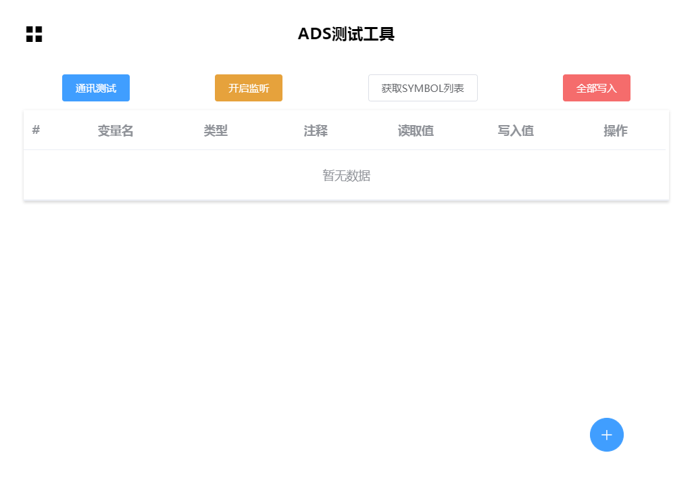
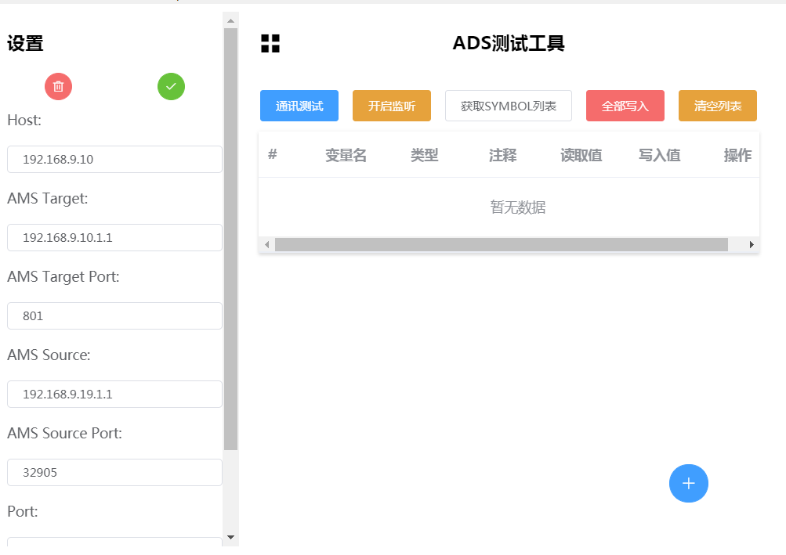
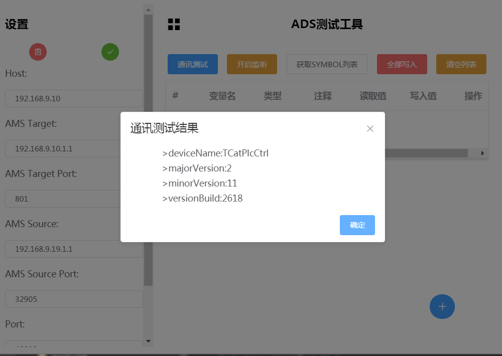
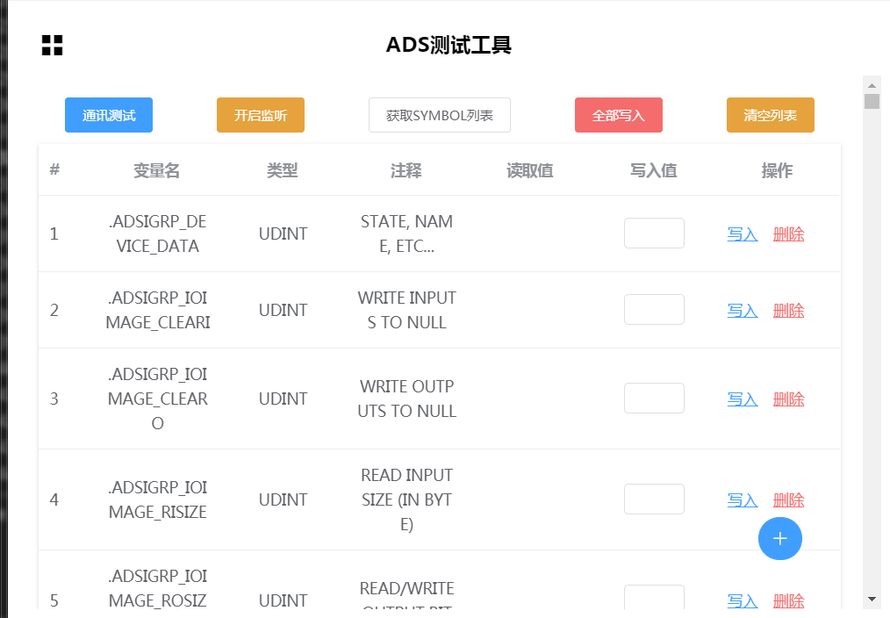

# TC ADS

[](https://forthebadge.com)
[](https://forthebadge.com)
[](https://forthebadge.com)

## About 
A project connect twincat2/3 ADS UI for Test and Study. 

This project is the implementation of this [Node-ADS Project](https://github.com/roccomuso/node-ads) with UI , Thank you to these people.

## Preview




## Plan
- Setting connect info √
- connect and connect test √
- Read register √
  - add/delete register √
  - read all register √
  - listen register √
- Write register 
- UI 
    - base ui √
    - excessive animation
    - more easy to use 
    - hot key

## Next
- I will complete the project when I have time , Let me know if I'm worth continuing with the project.
- Write register doesn't work yet, and I will fix it in next step.
## Build Setup

``` bash
# install dependencies
npm install

# serve with hot reload at localhost:9080
npm run dev

# build electron application for production
npm run build


# lint all JS/Vue component files in `src/`
npm run lint

```

---

This project was generated with [electron-vue](https://github.com/SimulatedGREG/electron-vue)@[8fae476](https://github.com/SimulatedGREG/electron-vue/tree/8fae4763e9d225d3691b627e83b9e09b56f6c935) using [vue-cli](https://github.com/vuejs/vue-cli). Documentation about the original structure can be found [here](https://simulatedgreg.gitbooks.io/electron-vue/content/index.html).
